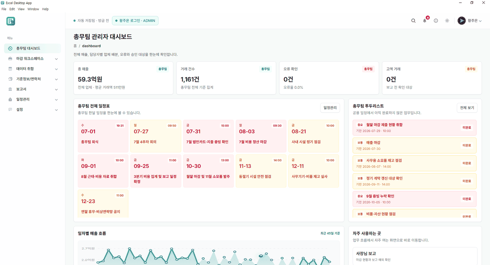
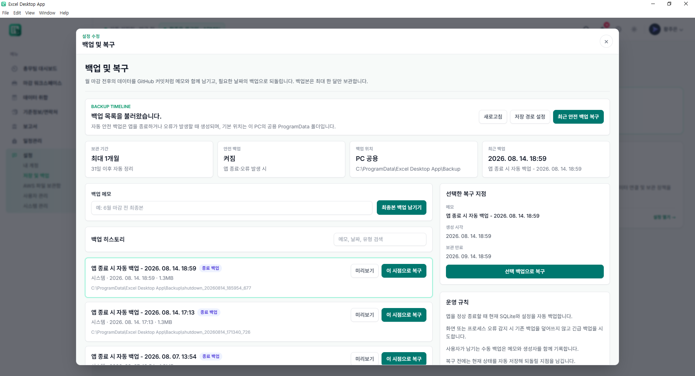
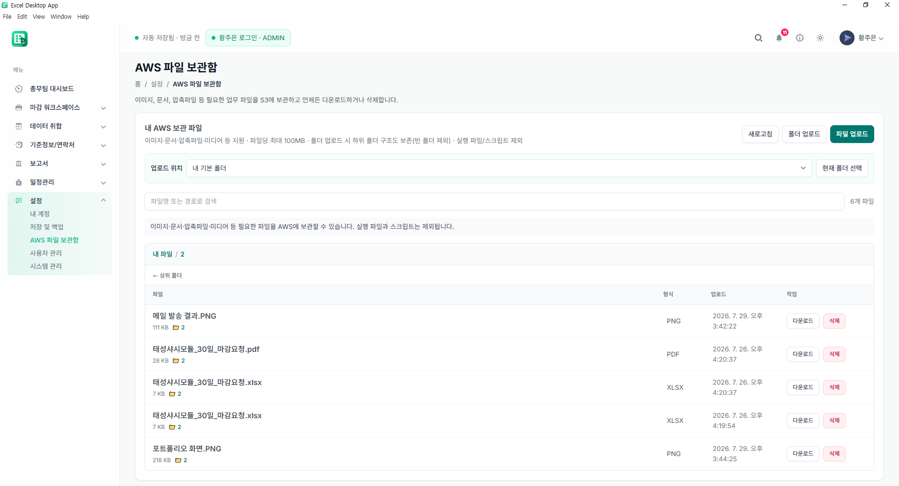

# 복잡한 업무를 간결한 사용자 경험으로 바꾸는 개발자 황주은입니다

### 사용자의 실제 업무 흐름을 이해하고,  
### 반복되는 과정과 불편을 **안정적이고 사용하기 쉬운 제품**으로 해결하고자 합니다.

1년 11개월 차 개발자이며, Vue와 Electron을 활용한 서비스 구축, eGovFrame 기반 시스템 개발 및 유지보수 경험을 통해 소프트웨어 생애주기 전반에 대한 이해도를 갖췄습니다.
표면적인 에러 해결에 그치지 않고 사용자가 실제로 겪는 업무 병목을 파악해 데이터 구조와 기능으로 풀어내는 데 강점이 있습니다. 
최근에는 React·Electron·AWS를 활용하여 기존에 파편화되어 있던 매출 마감 프로세스를 통합하는 'Offline-First 기반 자동화 데스크톱 앱'을 직접 설계 및 개발했습니다.

# 포트폴리오 한눈에 보기
https://rlahfld54.github.io/excel-desktop-app/showcase/

### 🎬 사용 화면

### 🖼 화면 미리보기

| 대시보드 | 데이터 검증 | 마감 |  백업 | AWS |
|:---:|:---:|:---:|:---:|:---:|
|  |  |  |  | |
 

 
 

 
 

## 🚀 Featured Project

### [Excel Automation Workspace](https://github.com/rlahfld54/excel-desktop-app)

Excel 데이터 검증부터 보고서 생성과 발송까지 하나의 흐름으로 연결한  
**React + Electron 기반 데스크톱 업무 자동화 애플리케이션**입니다.

- 반복적인 Excel 업무를 하나의 워크플로우로 통합
- 데이터 검증부터 보고서 생성까지 자동화
- Windows 데스크톱 환경에서 바로 사용할 수 있는 설치 파일 제공

 

 
 

## 🛠 Tech Stack

| Category | Technologies |
|---|---|
| Frontend |  Vue.js, React |
| Desktop | Electron |
| Database | PostgreSQL |
| Infrastructure | AWS |

 

## 💬 Contact

채용 및 프로젝트에 관한 이야기를 기다리고 있습니다.  
가장 빠른 연락은 **카카오톡 오픈채팅**을 이용해 주세요.

 
 

